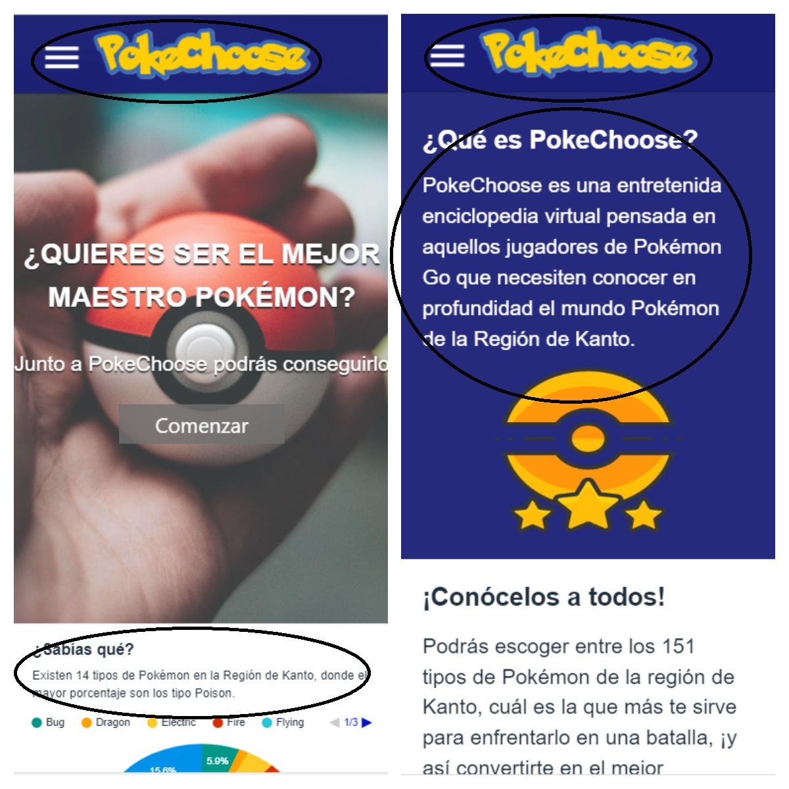
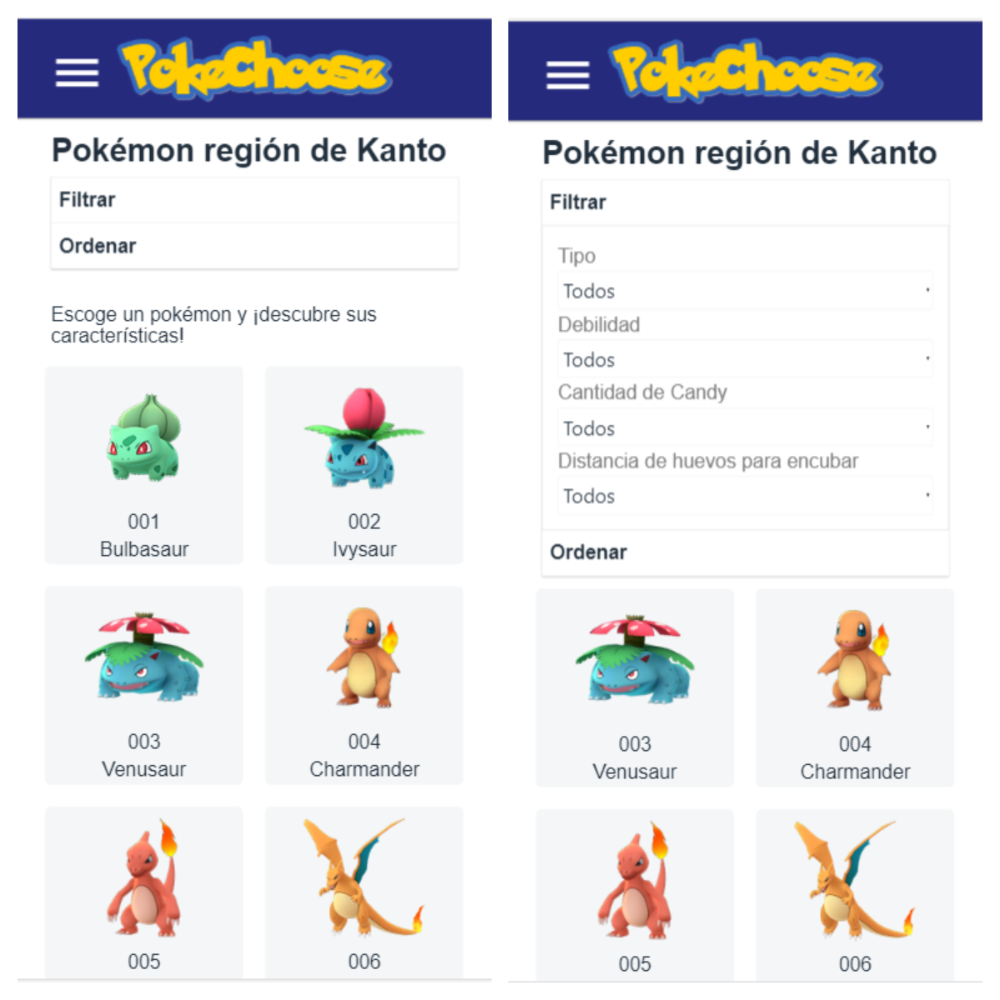
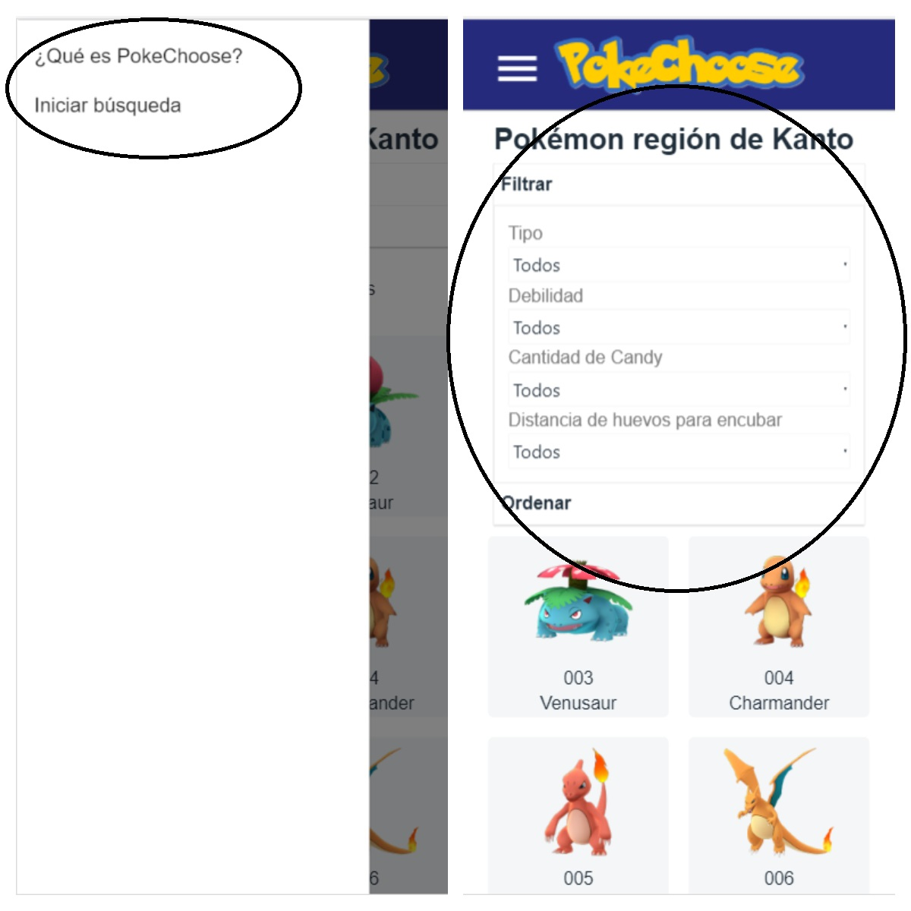
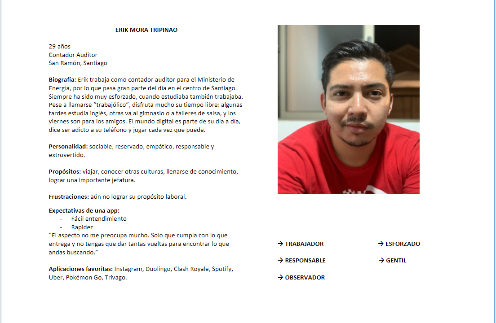
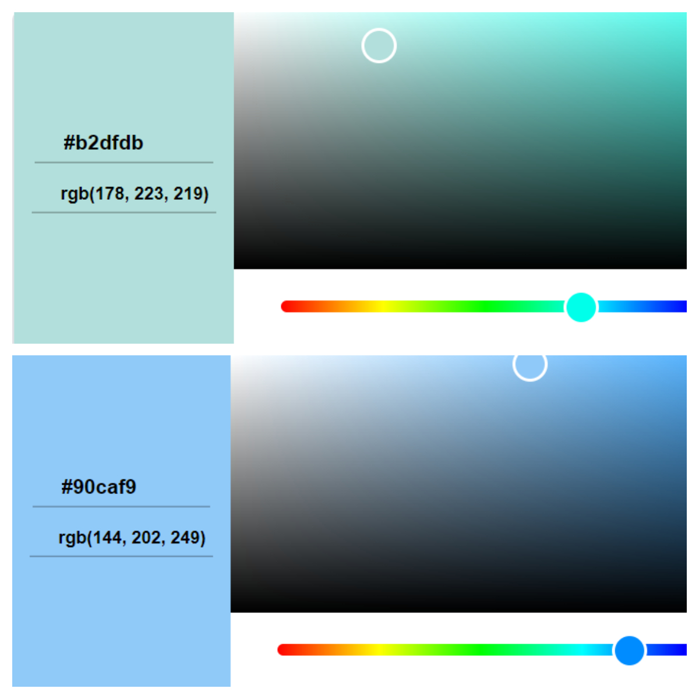
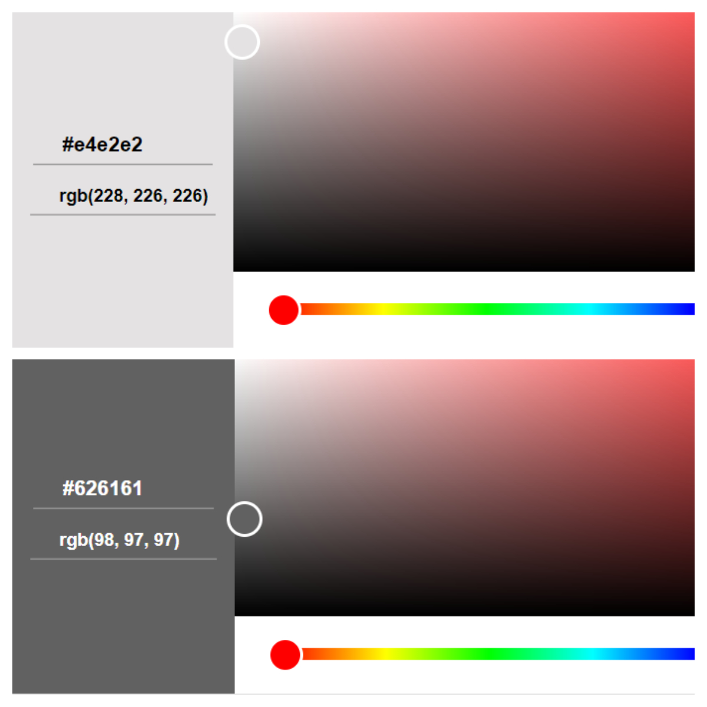
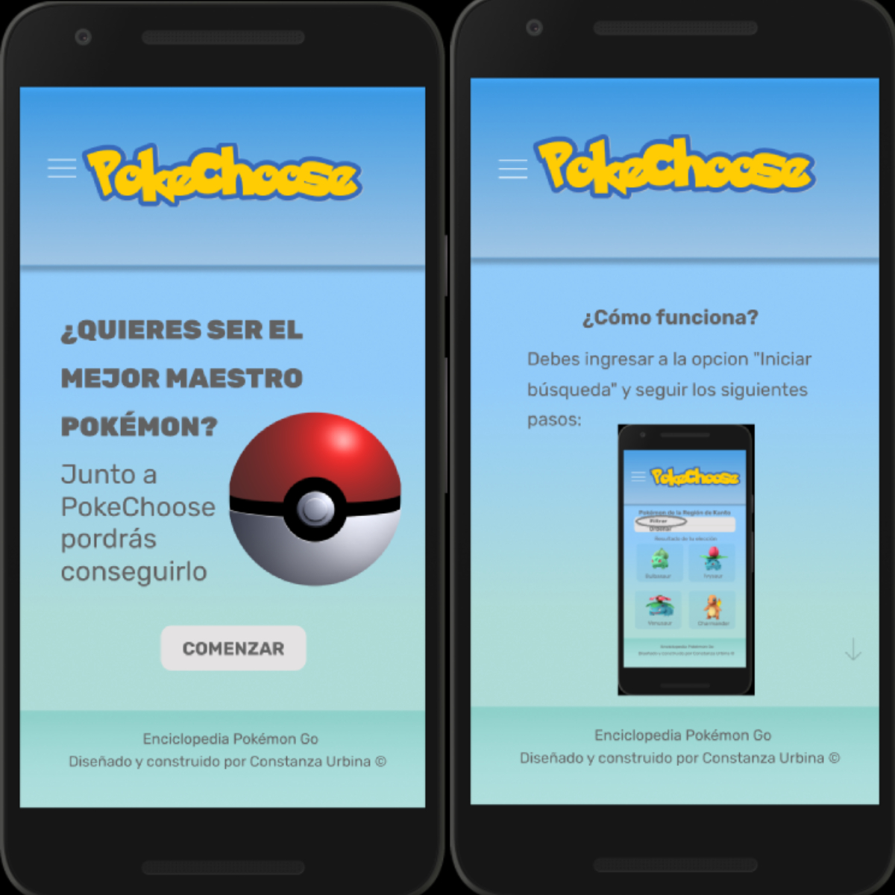
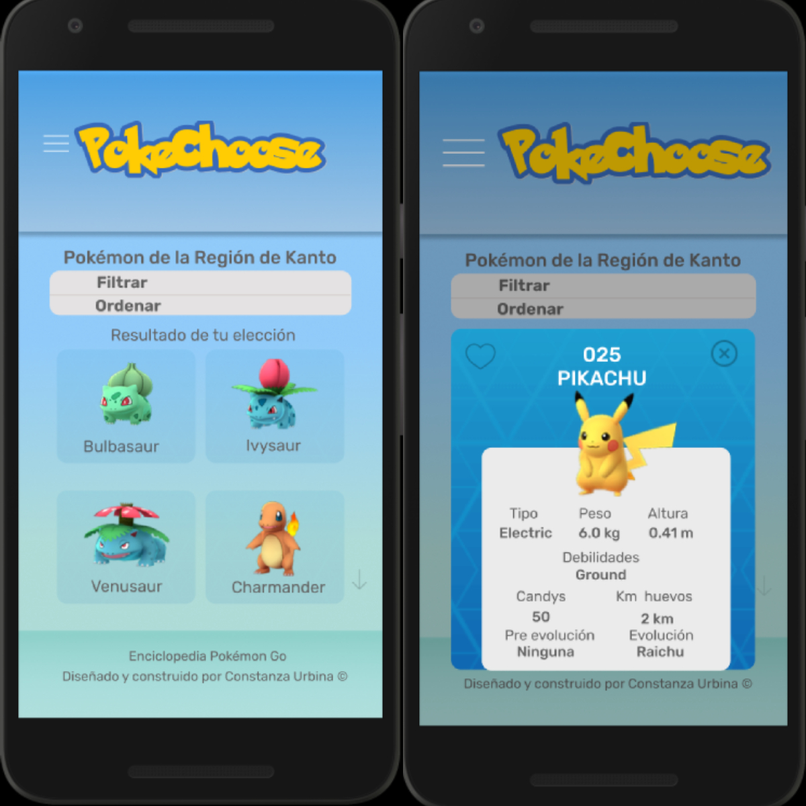

# El viaje extendido de PokeChoose 

## 🚀 Resumen del proyecto

Durante 3 semanas se construyó la aplicación web [PokeChoose](https://faog.github.io/SCL008-data-lovers/src/index.html),  que tuvo como objetivo principal ordenar una base de datos de Pokémon de forma atractiva, amigable y por sobre todo pensada en el usuario. 

Puedes encontrar **aquí** el [`README`](https://github.com/ConsUrbinaM/SCL008-data-lovers) de la primera iteración de este proyecto para conocer más sobre todo el proceso creativo y de programación que conllevó.

## ✒️ Nueva Iteración 

La segunda propuesta de [PokeChoose](https://faog.github.io/SCL008-data-lovers/src/index.html) surge por la inquietud de mejorar la usabilidad de esta aplicación, esta vez en un formato _responsivo_, creando un **nuevo prototipo de alta fidelidad** para  realizar nuevos testeos  que mejoren la experiencia de usuario del formato anterior.  

Para llevar a cabo este desafío, se tuvo  como consideración los principios del diseño visual y la evaluación heurística de la primera iteración del proyecto. A partir de ello se realizó la reconstrucción de la aplicación, según los intereses de un usuario **específico** y **real** con un User Persona, incluyendo la identificación de colores por medio de  psicología del color, y la búsqueda de referentes de diseño visual a partir de otras aplicaciones web.

### 📹 Principios del diseño visual 

1. Contraste: 

* Uso del color de fondo con una tipografía adecuada que le permita al usuario interesarse por el contenido de la página. 

* Jerarquía del contenido que evidencie qué contenidos son más importantes o cuales son subtemas. 

2.	Repetición: 

* Los elementos que comparten características de tipografía, color y tamaño pertenecen al mismo grupo jerárquico, dándole consistencia a la aplicación: cada uno de ellos (títulos, subtítulos, color de botones) tiene una función específica. 

* Consistencia: la forma de los elementos permiten el uso de la página de la misma forma en que  han ocupado otras aplicaciones anteriormente:

  La página cuenta con un selector que contiene el menú a la izquierda arriba, que incluye las distintas funcionalidades de la página.

  

3.	Alineación:

* Cada elemento de la aplicación está posicionado en el mismo lugar en todas las interfaces, generando la unión del contenido.  

* La alineación está hacia la izquierda y no utiliza el contenido justificado.

 

4.	Proximidad: 

* Se mantienen los elementos que contienen información similar agrupados y aquellos que no están relacionados separados.

 

### 📑 Evaluación Heurística 

Esta herramienta permite visualizar cuáles son los objetivos de la aplicación y si ellos se cumplen.

Puedes ver **aquí** la [Evaluación Heurística](https://drive.google.com/file/d/10j_WWvphYdfajooaQTkhrZfaPTDmmbkB/view?usp=sharing)

¿Cuáles son los aspectos a mejorar? 

* Empate entre el sistema y el mundo real 
1. La presentación de los contenidos es familiar o comprensible para el usuario: la información estadística confunde dentro de la primera pantalla por lo que debería tener una sección especial dentro del menú que aplique sólo a las estadísticas. 

* Consistencia y estándares

1. Las etiquetas de los vínculos tienen los mismos nombres que los títulos de las páginas a las que se dirigen: en este caso se considera que cierta información que entrega la aplicación (estadísticas y cómo funciona) no encuentran un espacio dentro del menú, pese a que no son difícil de acceder. 

* Ayuda y documentación 

1. La documentación de ayuda es sensible al contexto, se refiere a la sección donde se encuentra el usuario: la aplicación considera el "qué es" y "cómo funciona" dentro de una misma categoría, por lo tanto no hace la diferencia para ingresar a una página tutorial. 

2. La documentación de ayuda sobre accesibilidad está adaptada a las necesidades del usuario:  la aplicación no cuenta con alternativas de visualización para personas con alguna discapacidad. 

3. La página dispone de un apartado de preguntas frecuentes: la aplicación no cuenta con un apartado de preguntas frecuentes, pese a que considera la explicación del uso por medio de un tutorial. 

### 👨 User Persona 

En la primera iteración se realizó una [encuesta](https://docs.google.com/forms/d/1tS5dteTqStz4BMEkpbQ3pghEVAidVwr08N6nTFHm-xY/edit) que obtuvo el alcance del público objetivo a **nivel general** (rango de edad y elementos de interés sobre Pokémon); en esta segunda iteración se consideran los siguientes elementos para construir el **User Persona** y optimizar el uso de la página: 

* Saber cuáles son sus características, intereses, y gustos
* Cómo define su personalidad, en cuanto a objetivos y metas. 
* Cuáles son sus aplicaciones favoritas y que espera de ellas. 

### 💡 Psicología del color 

El propósito es identificar las percepciones que tienen los usuarios respecto a los colores que serán ocupados por la aplicación. Pensando en los usuarios (identificados a partir de la encuesta abierta y la utilización del user persona) e inspirado en la aplicación de Pokémon Go, la elección fue la siguiente:

**Colores base**

1.	Verde: se relaciona con la naturaleza, equilibrio y crecimiento. Está asociado a aplicaciones que le permitan al usuario aprender idiomas, viajar y conocer nuevos lugares. 

2.	Azul: que se relaciona con confianza, seguridad, lealtad y frialdad. Está asociado a aplicaciones más formales o de trabajo. 

La idea fué fusionar ambos colores con el fin de lograr uno más parecido al que entrega la aplicación de Pokémon Go, probando con distintos tipos de degradación hasta llegar a el resultado: 

**Colores de contraste**

3.	Gris: entrega paz  y tenacidad.

4.	Blanco: simpleza absoluta. 

Los colores de contraste fueron utilizados para resaltar textos y botones dentro de los colores base:

### ⌨️ Inspiración de distintas páginas 

Se rescataron diferentes elementos de páginas (en formato responsivo) para la recreación de la aplicación responsiva de PokeChoose. En este caso sirvió la identificación de colores, distribución del espacio, uso del menú y tarjetas. 

1.	[Pokemon Go](https://www.pokemongo.com/es-es/) 
2.	[Detective Pikachu](http://www.detectivepikachumovie.net/)
3.	[PokeCoins](http://26109.p0k3.org/)
4.	[Falabella](https://www.falabella.com/falabella-cl/) 

### ✒️ Propuesta de nuevo Figma responsivo 

Se crea un **nuevo prototipo de alta fidelidad** que contempla las necesidades del usuario (identificadas en la _encuesta_, testeos durante la primera iteración, aplicación de _User Persona_ e _Historias de Usuario (HU)_) en cuanto a los _colores_ y _disposición de la información_,  para facilitar el uso de la aplicación. 

Puedes encontrar **aquí** el nuevo [Figma](https://www.figma.com/proto/ch2aScrXNix5RjRCER5etaYm/Responsive-PokeChoose?node-id=0%3A1&scaling=scale-down)

### 📋 Testeo en formato responsivo

Utilizando [Figma](https://www.figma.com/proto/ch2aScrXNix5RjRCER5etaYm/Responsive-PokeChoose?node-id=0%3A1&scaling=scale-down), se testeó a 5 usuarios, entre ellos jugadores aficionados y principiantes que indicaron por medio de feedback próximas mejoras a aplicar en el prototipo de alta fidelidad.

La tarea a realizar es: 

1.	Encontrar a los pokémon de tipo eléctrico.
2.	Ver la ficha de un pokémon de tipo eléctrico.
3.	A partir de la ficha lograr llegar a la página tutorial. 

* [Testeo Cristóbal](https://drive.google.com/file/d/11fa7jwIo47oOMvngjCi7ZoVF9xIymT1L/view?usp=sharing)
* [Testeo Katty](https://drive.google.com/file/d/1jLobGW8NKzgNCKLOW6rlCiBJrq5SLZVE/view?usp=sharing)
* [Testeo Benjamín](https://drive.google.com/file/d/1bHYgUKkwmzRuzeYAWmS8O6ZWEBkJNNFI/view?usp=sharing)
* [Testeo Scarlet](https://drive.google.com/file/d/1osZhi6VOHyzCV-rBHfGRV7SEHhd5aijr/view?usp=sharing)
* [Testeo Juan](https://drive.google.com/file/d/1botcmZSIRZQFyUGfUIN_1YAbWvr05skN/view?usp=sharing)

Dificultades identificadas a partir del prototipo de alta fidelidad:

1. Dificultad para encontrar el cambio de página dentro del tutorial para ver las instrucciones siquientes, por lo que hace parecer que la instrucción es muy corta. 
2. La página no indica de forma textual los resultados de la búsqueda (ejemplo: "resultados de búsqueda por tipo electric"). 
3. El usuario tiende a buscar más información del tutorial deslizando la imagen de la pantalla hacia el lado y no hacia abajo.  
4. Se ve lentitud en el uso de la aplicación. 
5. La tarea para el usuario fue encontrar el tipo "eléctrico" dentro de la aplicación y el menú arroja el tipo "electric". Pese a la similitud de las palabras, es mejor dar las instrucciones de manera clara para poder completar la tarea.  

### 🛠️ Proximas mejoras 

* Identificar el modo de generar movimiento de la pantalla en formato responsivo para lograr acceder a más información, sin la necesidad de utilizar un scroll o flecha representativa, ya que en el celular el usuario tiene movimientos predeterminados sin la necesidad de una instrucción. 

* Incorporar una barra que les permita llegar a la información de algún Pokémon específico al que usuario desee acceder, sin las limitantes del filtrado u ordenado.  

* Manejar otra aplicación (que no sea Figma) para crear prototipos de alta fidelidad. En esta oportunidad se visualizaron problemas al cargar la página al momento de hacer cambio de una pantalla a otra, pese a encontrar el manejo más fluido de la aplicación desde celulares con sistema ``iOS`` por sobre los ``android``.

* Perfeccionar el trato con los usuarios al momento de realizar los testeos, dando las instrucciones de forma clara y amable, con el fin de no confundirlos y que accedan específicamente a las funcionalidades que desean ser evaluadas.  

### 📌Autora 

* Constanza Urbina 
* 8° Generación de Laboratoria Chile
* Marzo, 2019 

